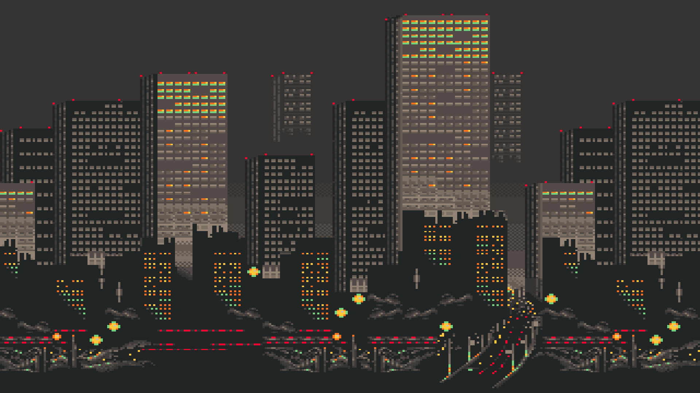
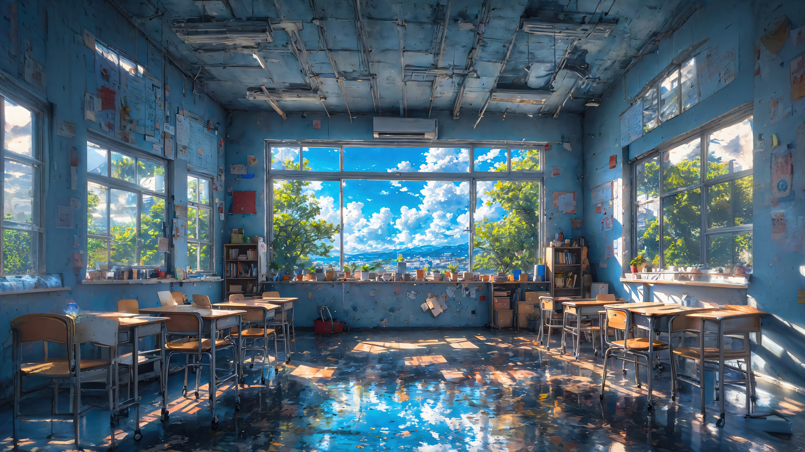
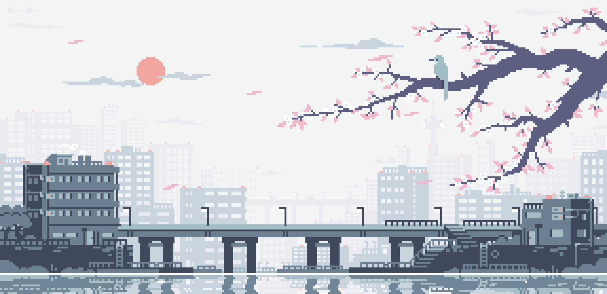
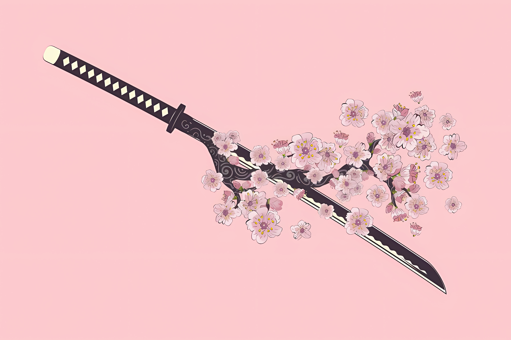
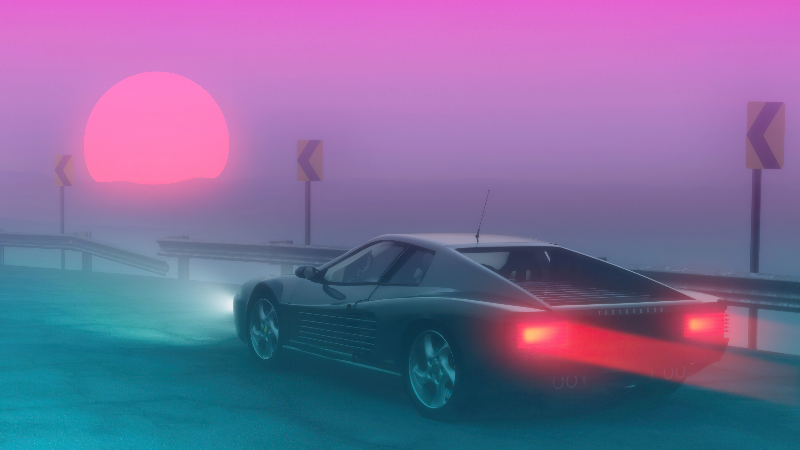

# 🌄 Wallz — My Wallpaper Collection

A curated collection of wallpapers I use for lock screens, profile photos, banners, and desktop backgrounds. Browse, save, and enjoy — most images are sourced from Wallhaven, WallpapersDen, or other public image collections.

## **Some of my favourites**

<table border="1">
    <tr>
        <td align="center"></td>
        <td align="center"></td>
        <td align="center"></td>
        <td align="center"></td>
    </tr>
    <tr>
        <td align="center"></td>
        <td align="center"></td>
        <td align="center"></td>
        <td align="center"></td>
    </tr>
</table>

---

## 📁 Structure

- `pfps/` — profile photos and small images
- `wallpapers/` — full-size wallpapers (browse the folder to see everything)

## ⚙️ Usage

---
